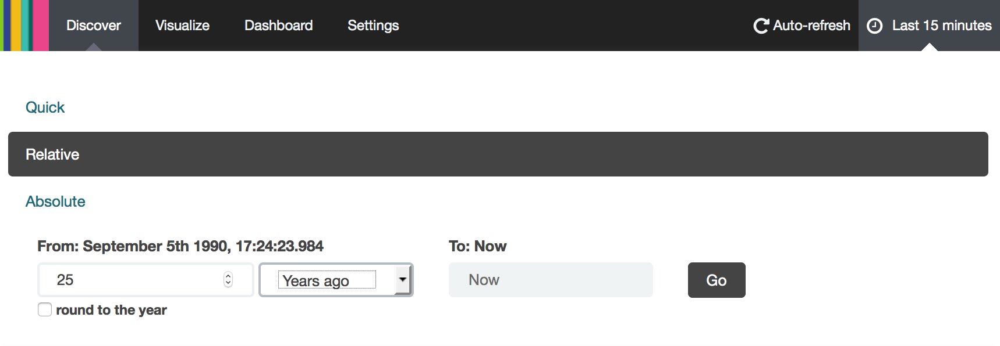

# Parl-Scraping
## Context

This is a [Opendata.ch Elections Hackdays](http://make.opendata.ch/elections) project.  
This hackathon is happening Sep. 4-5 2015 in Lausanne (Le Temps newsroom) and Zurich (NZZ newsroom).  
A [wiki](http://make.opendata.ch/wiki/project:chparlscraping) is available for this project.  

## Where to go next

Do you want to take over this project? Here's what needs to be done first:

- Clean up the date fields. For now, the elasticsearch_upload.py script converts to dates to ISO format, 
it could be better done upstream.
- Configure elasticsearch to extract significant terms from the transcriptions, or run NLP TF/IDF

## Sources

[Minutes of the parliament](http://www.parlament.ch/ab/frameset/f/index.htm)

[Parliament API](http://ws.parlament.ch/)

[API doc](http://www.parlament.ch/e/dokumentation/webservices-opendata/Documents/webservices-info-dritte-e.pdf)

## Setup

- Meeting minutes are scrapped from confederation website using python scripts in the project parl_scraper
- We use elasticsearch to expose a text query interface on top of the json's
- We use Kibana on top of elastic search to do visualization of the text searches

## How to

### Fetching data from parlament website

Source: minutes of National Council from http://www.parlament.ch/ab/frameset/f/index.htm

Parsed URL list from ./debates-urls.txt

Install Scrapy: http://doc.scrapy.org/en/latest/intro/install.html

Project name: "hackaton"

Move to /hackaton

Run:

    scrapy crawl CNbasic2 -o json_fixtures/items-full-final.json
    scrapy crawl CNbasic2 -o json_fixtures/items-full-final.csv

To export in json or csv respectively. Use ...

#### Python development

Setup virtualenv:

    virtualenv env
    source env/bin/activate

Install the packages and its dependencies:

    python setup.py install
    python setup.py develop
    
## Overview of the architecture

- Meeting minutes are scrapped from confederation website using python scripts in the project parl_scraper
- We use elasticsearch to expose a text query interface on top of the json's
- We use Kibana on top of elastic search to do visualization of the text searches

## Running docker elasticsearch/kinaba containers:

start :

    ./start_env.sh

stop :

    ./stop_env.sh

    
connect in ssh to container :

    ./conn [es | kib]

## Docker:

The commands that actually worked for us on DigitalOcean:

    docker run -p 3333:9200 -p 3334:9300 -d --name=elasticsearch elasticsearch
    docker run --link elasticsearch:elasticsearch -p 3335:5601 -d kibana
    
    
## Data format:

The `/data` folder contains two representations of the intervention transcripts. The first is a JSON file. 
It contains an array of objects, of which each object contains the following keys:

    Link_subject: link to the page of the subject under discussion
    Surname: of the person speaking
    Description: of the subject under discussion
    Bio: link to the page of the person speaking
    Canton: of provenance
    Subject_id: of the subject under discussion
    Date: of the intervention (DD.MM.YY)
    Group: political group of the person speaking at the moment of the intervention
    Session_title: title of the session (Séance)
    Data: transcript of the intervention
    Name: of the person speaking
    
The second representation is a CSV file with the same data, where each object described above occupies one line.

### Import into elasticsearch

To import the data into elasticsearch, unzip the JSON data and move all JSON files to a new folder:

    cd data
    mkdir json
    unzip json-merged.json
    mv *.json json/
    cd ..
    
Then use the upload script to upload to the elasticsearch server. Assuming the server is running on localhost on port 
3333, the following command uploads all the entries in all the json files to elasticsearch:

    python scripts/elasticsearch_upload.py data/json http://localhost:3333/parlament/intervention
    
This creates the entries under the `parlament` index.

### Kibana

Once the data is uploaded into elasticsearch, go to Kibana (at localhost:3335 if you followed the instructions above), 
then create a default index:

Now the data is searchable. **In order to see anything**, you must select a wide date range though. 
Head over to the "Explore" tag, then select posts for the past 25 years:

Now play around with search terms, visualizations, and dashboards. Try searching for Raclette for example:

Then make a visualization: go to Visualizations -> Pie Chart -> From New Search -> Split Slices; 
then Aggregate by Terms, and select your preferred Field.

