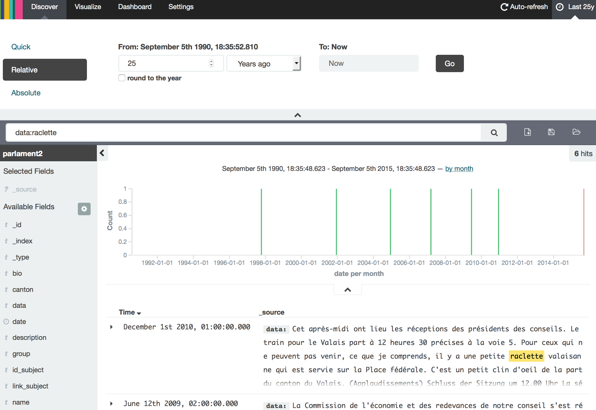
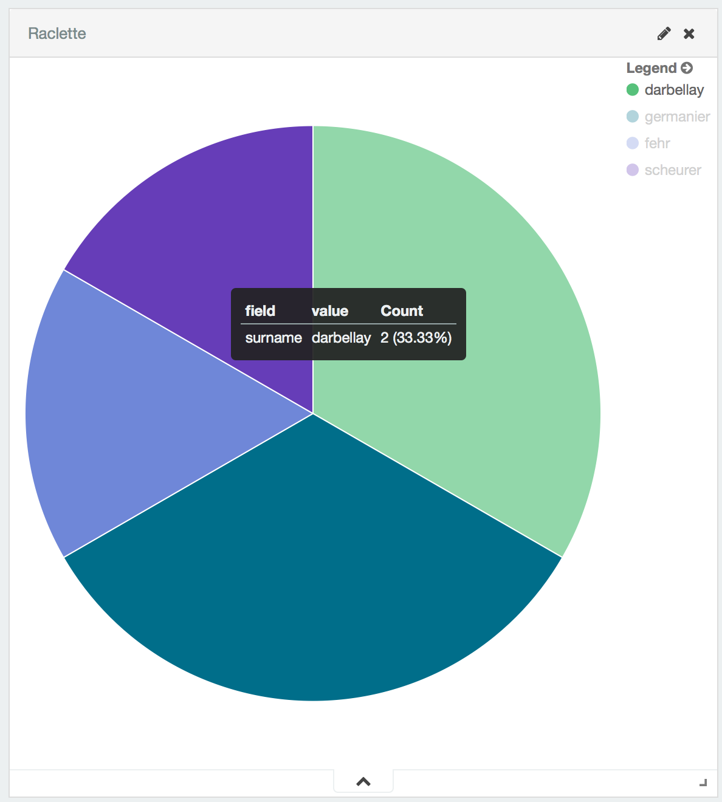
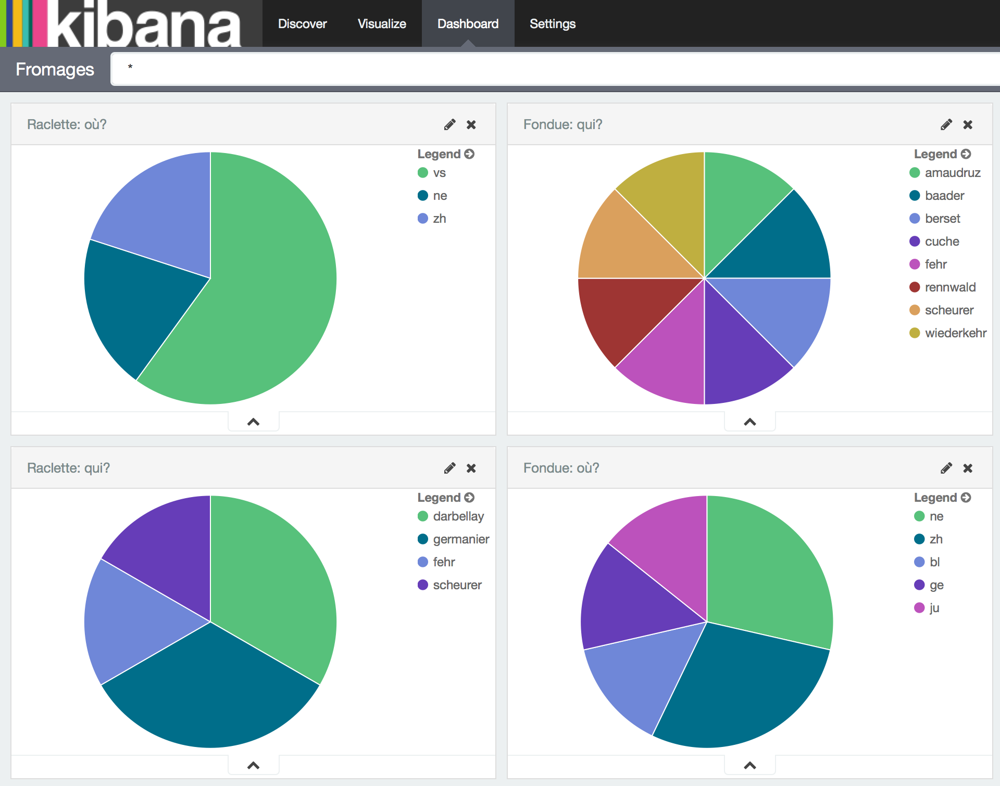
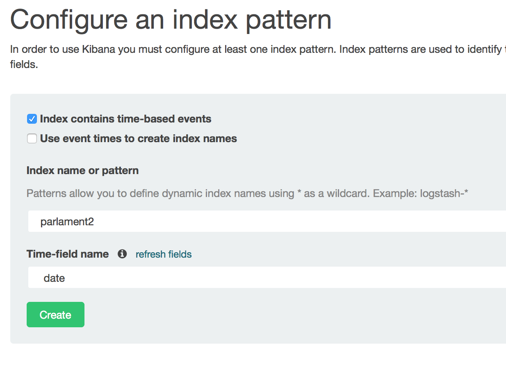

# Parl-Scraping

We have created an easily re-usable data set of transcriptions of all parliamentary interventions since 1990. Download the CSV or JSON, or play with the data interactively by heading over to:

[http://parlement.letemps.ch](http://parlement.letemps.ch)

Play around with search terms, visualizations, and dashboards. Try searching for Raclette for example:



Then make a visualization: go to Visualizations -> Pie Chart -> From New Search -> Split Slices;  then Aggregate by Terms, and select your preferred Field.



Once you have saved visualizations, you can add them to dashboards. Have a look at this one:




<!-- TOC depth:6 withLinks:1 updateOnSave:1 orderedList:0 -->

- [Parl-Scraping](#parl-scraping)
  - [Context](#context)
  - [Where to go next](#where-to-go-next)
  - [Sources](#sources)
  - [Setup](#setup)
  - [How to](#how-to)
    - [Fetching data from parlament website](#fetching-data-from-parlament-website)
      - [Fetching the list of URLs for the minutes full text](#fetching-the-list-of-urls-for-the-minutes-full-text)
      - [Scraping the fulltext HTML pages](#scraping-the-fulltext-html-pages)
      - [Fetching the biographic data for each member of parliament](#fetching-the-biographic-data-for-each-member-of-parliament)
      - [Merging the fulltext and biographic data](#merging-the-fulltext-and-biographic-data)
      - [Converting the JSON files to CSV](#converting-the-json-files-to-csv)
      - [Python development](#python-development)
  - [Overview of the architecture](#overview-of-the-architecture)
  - [Running docker elasticsearch/kinaba containers:](#running-docker-elasticsearchkinaba-containers)
  - [Docker:](#docker)
  - [Data format:](#data-format)
    - [Import into elasticsearch](#import-into-elasticsearch)
    - [Kibana](#kibana)

<!-- /TOC -->


## Context
This is a [Opendata.ch Elections Hackdays](http://make.opendata.ch/elections) project.<br>This hackathon is happening Sep. 4-5 2015 in Lausanne (Le Temps newsroom) and Zurich (NZZ newsroom).<br>A [wiki](http://make.opendata.ch/wiki/project:chparlscraping) is available for this project.  

## Where to go next
Do you want to take over this project? Here's what needs to be done first:
- Clean up the date fields. For now, the elasticsearch_upload.py script converts to dates to ISO format,
- it could be better done upstream.
- Configure elasticsearch to extract significant terms from the transcriptions.

## Sources
[Minutes of the parliament](http://www.parlament.ch/ab/frameset/f/index.htm)

[Parliament API](http://ws.parlament.ch/)

[API doc](http://www.parlament.ch/e/dokumentation/webservices-opendata/Documents/webservices-info-dritte-e.pdf)

## How to
### Fetching data from parlament website
#### Fetching the list of URLs for the minutes full text
Source: minutes of National Council from [http://www.parlament.ch/ab/frameset/f/index.htm](http://www.parlament.ch/ab/frameset/f/index.htm)

The script `parl_scraper/get-debates-urls.sh` fetches the table-of-content HTML files for all minutes, parses the files to extract the fulltext URLs and writes the result to `parl_scraper/debates-urls.txt`. By default the script's downloading part is commented-out, you can use the pre-downloaded files in `parl_scraper/tables-of-content.tar.xz` instead.

#### Scraping the fulltext HTML pages
Install Scrapy: [http://doc.scrapy.org/en/latest/intro/install.html](http://doc.scrapy.org/en/latest/intro/install.html)

Project name: "hackaton"

Move to /hackaton

In the `parl_scraper` directory, run:

```
scrapy crawl CNbasic2 -o ../data/items-full-final.json
scrapy crawl CNbasic2 -o ../data/items-full-final.csv
```

#### Fetching the biographic data for each member of parliament
The script `biography_retrieval/retrieve.R` downloads all the biographic data into the `bio_json` and `bio_xml` subdirectories.

#### Merging the fulltext and biographic data
The `scripts/merge_bios.py` script can be used to generate either one JSON file with the merged data, or one JSON file per legislative session.

For the first case, give it the input and output files:

```
scripts/merge_bios.py data/items-full-final.json data/items-full-final-with-bio.json
```

For the second case, give it an existing directory as second argument:

```
scripts/merge_bios.py data/items-full-final.json data/with-bio-split-json
```

#### Converting the JSON files to CSV
The program `scripts/csv_convert.go` can be used to convert a JSON file to CSV. To build, run `go build csv_convert.go` in the `scripts` directory.

To run, give it the input and output file names:

```
scripts/csv_convert data/items-full-final-with-bio.json data/items-full-final-with-bio.csv
```

To convert all JSON files from `data/with-bio-split-json` into CSV files in the (pre-existing) directory `data/with-bio-split-csv`, you can run the following shell command:

```
for i in data/with-bio-split-json/*.json; do scripts/csv_convert "$i" "${i//json/csv}"; done
```

## Data format:
The `data` folder contains two representations of the intervention transcripts. The first is a JSON file.  It contains an array of objects, of which each object contains the following keys:

```
Link_subject: link to the page of the subject under discussion
Surname: of the person speaking
Description: of the subject under discussion
Bio: link to the page of the person speaking
Canton: of provenance
Subject_id: of the subject under discussion
Date: of the intervention (DD.MM.YY)
Group: political group of the person speaking at the moment of the intervention
Session_title: title of the session (Séance)
Data: transcript of the intervention
Name: of the person speaking
```

The second representation is a CSV file with the same data, where each object described above occupies one line.

These data are available in the archives `data/items-full-final-with-bio.json.zip` and `data/items-full-final-with-bio.csv.zip` respectively.

The same datasets split by legislative session are available in the archives `data/with-bio-split-json.zip` and `with-bio-split-csv.zip`.

### Python development
Setup virtualenv:

```
virtualenv env
source env/bin/activate
```

Install the packages and its dependencies:

```
python setup.py install
python setup.py develop
```

## Overview of the architecture

- Meeting minutes are scraped from confederation website using python scripts in the project parl_scraper
- We use elasticsearch to expose a text query interface on top of the json's
- We use Kibana on top of elastic search to do visualization of the text searches

## Running docker elasticsearch/kibana containers:
start :

```
./start_env.sh
```

stop :

```
./stop_env.sh
```

connect in ssh to container :

```
./conn [es | kib]
```

## Docker:
The commands that actually worked for us on DigitalOcean:

```
docker run -p 3333:9200 -p 3334:9300 -d --name=elasticsearch elasticsearch
docker run --link elasticsearch:elasticsearch -p 3335:5601 -d kibana
```

### Import into elasticsearch
To import the data into elasticsearch, unzip the JSON data and move all JSON files to a new folder:

```
cd data
unzip with-bio-split-json.zip
cd ..
```

Then use the upload script to upload to the elasticsearch server. Assuming the server is running on localhost on port  3333, the following command uploads all the entries in all the json files to elasticsearch:

```
python scripts/elasticsearch_upload.py data/with-bio-split-json http://localhost:3333/parlament/intervention
```

This creates the entries under the `parlament` index.

### Kibana

Once the data is uploaded into elasticsearch, go to Kibana (at localhost:3335 if
you followed the instructions above),  then create a default index:



Now the data is searchable. Refer to the tutorial. To change the default date
range, you need to change Kibana's source  code. Connect to your kibana
instance, install vim, and change a line in the public `index.js` file:

```
host~$ docker exec -i -t kibana bash
kibana~$ apt-get update && apt-get install vim
kibana~$ vim /opt/kibana/src/public/index.js
```

Find the following block:

```
 var timeDefaults = {
    from: 'now-15m',
    to: 'now',
    mode: 'quick'
  };
```

And replace it with:

```
 var timeDefaults = {
    from: 'now-25y',
    to: 'now',
    mode: 'quick'
  };
```

Now reload Kibana in your browser.
